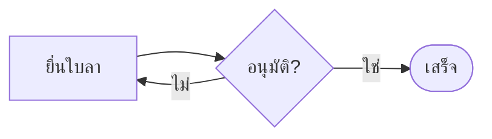
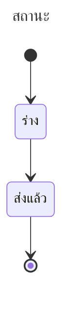

# ตัวอย่างเอกสาร

ข้อความนำ


```mermaid
flowchart LR
  A[ยื่นใบลา] --> B{อนุมัติ?}
  B -- ใช่ --> C([เสร็จ])
  B -- ไม่ --> A
```

```js
console.log(1)
```


```mermaid
---
title: สถานะ
---
stateDiagram-v2
  [*] --> ร่าง
  ร่าง --> ส่งแล้ว
  ส่งแล้ว --> [*]
```
